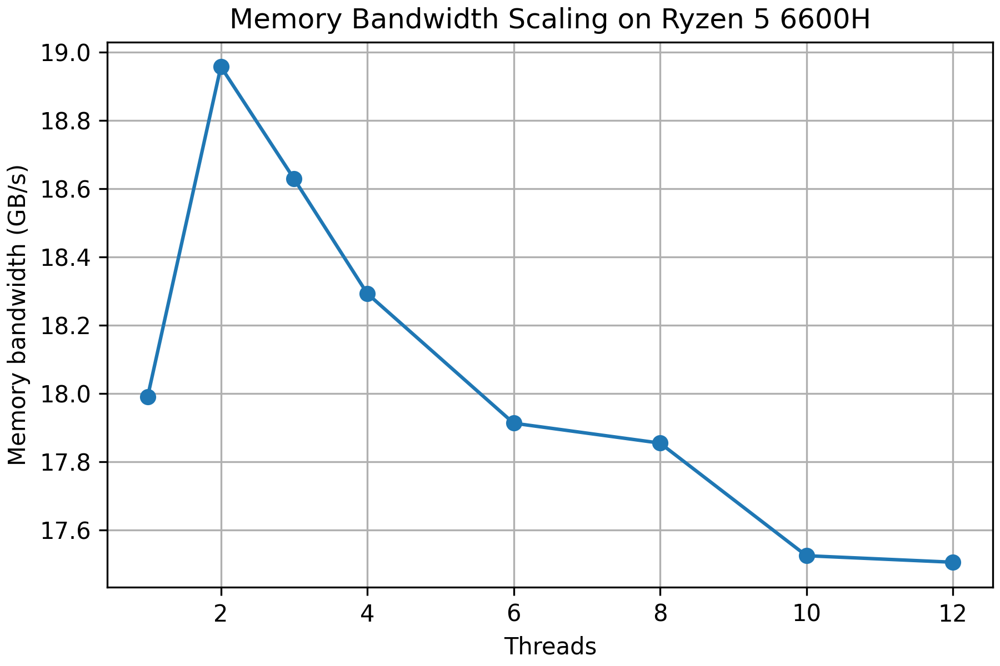

## Acknowledgement
The files in the current directory `STREAM` has been obtained **unmodified** from the 
 published by 
**Dr. John D McCalpin** at the University of Virginia. as per complete acceptance of 
terms mentioned in 
. 


## Observed Memory Bandwidth 
### Methodology
The standard `Triad` numerical kernel from `STREAM` benchmark suite was used to 
measure the sustained main-memory bandwidth on the current hardware (AMD Ryzen 5 6600H).

STREAM's Trias kernel evaluates:
```
A[i] = B[i] + scalar * C[i]
```
This operation stresses memory bandwidth due to low arithmetic intensity and large sequential 
memory transfers.

The benchmark was compiled with aggreesive optimization and OpenMP enabled:
```bash 
cd STREAM 
gcc -O3 -march=native -fopenmp -DSTREAM_ARRAY_SIZE=50000000 stream.c -o stream
```

An array size of 50,000,000 elements was selected to ensure the working set significantly 
exceeds the last-level cache capacity, thereby enforcing DRAM-bound execution.

The executable was evaluated across multiple thread counts:
```bash 
mkdir results 
OMP_NUM_THREADS=1 ./stream > results/thr1.txt 
OMP_NUM_THREADS=2 ./stream > results/thr2.txt 
OMP_NUM_THREADS=3 ./stream > results/thr3.txt 
OMP_NUM_THREADS=4 ./stream > results/thr4.txt 
OMP_NUM_THREADS=6 ./stream > results/thr6.txt 
OMP_NUM_THREADS=8 ./stream > results/thr8.txt 
OMP_NUM_THREADS=10 ./stream > results/thr10.txt 
OMP_NUM_THREADS=12 ./stream > results/thr12.txt 
```

For each configuration, multiple runs were performed. Reported values correspond to the 
final iteration after confirming negligible variance across trials. The Triad bandwidth 
metric was used as the representative sustained memory bandwidth.


## Result
The peak memory bandwidth across `Triad` kernel was observed using `OMP_NUM_THREADS=2` at 
`18.956 GB/s`. The Memory Bandwidth variation across multiple threads can be observed below.


